# Architecture Diagrams

## System Overview

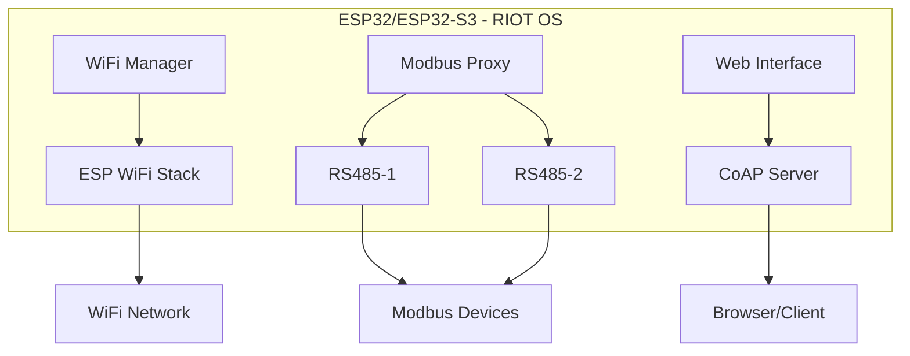

## Data Flow

### Modbus Frame Processing

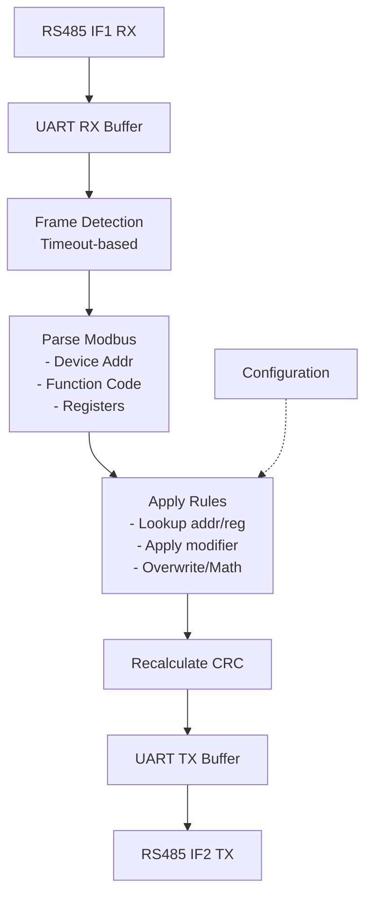

## Threading Model

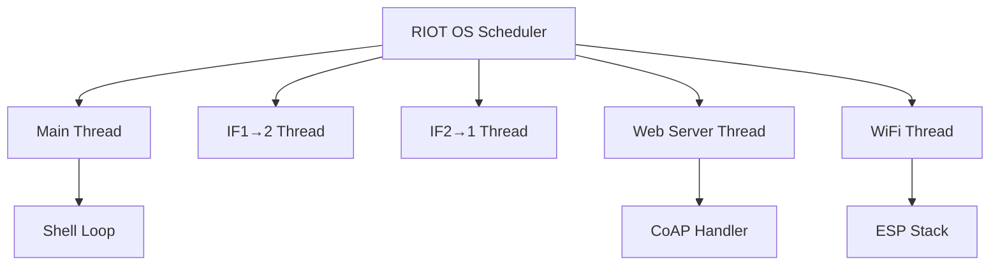

### Thread Priorities

```
Priority Level    Thread
──────────────────────────────────
Main - 2          Web Server
Main - 1          Modbus IF1→2
Main - 1          Modbus IF2→1
Main              Main Thread
(Lower)           WiFi Thread
```

## Memory Layout

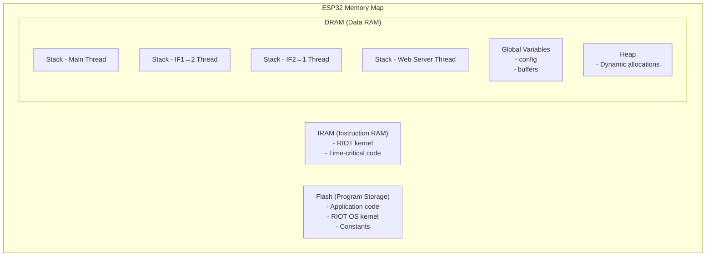

## Configuration Storage (Future)

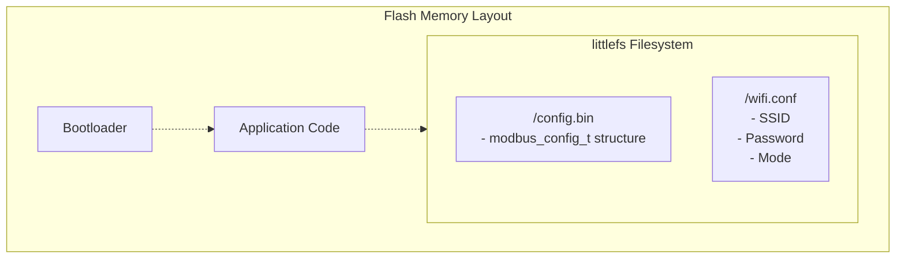

## Network Architecture

### Access Point Mode

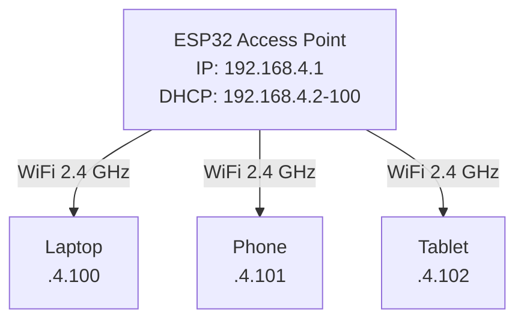

### Station Mode

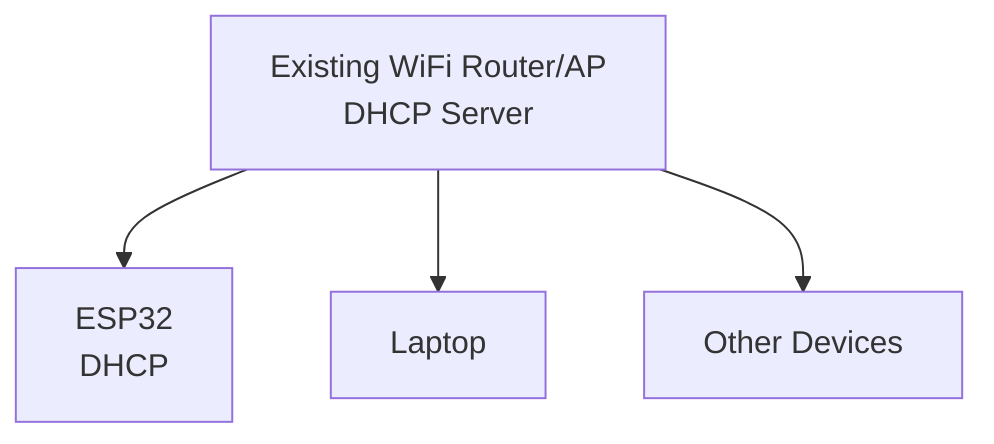

## RS485 Physical Layer

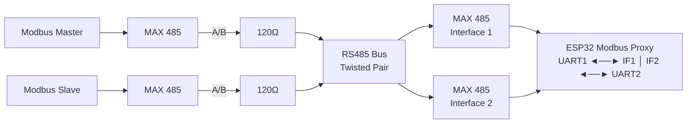

## Modbus Frame Format

**Generic Modbus Frame:**
```
┌──────┬──────┬──────┬────────────┬─────┬─────┐
│ Addr │ Func │ Data │    ...     │ CRC │ CRC │
│  1B  │  1B  │  nB  │            │  L  │  H  │
└──────┴──────┴──────┴────────────┴─────┴─────┘
```

**Example Read Holding Registers (0x03) Request:**
```
┌──────┬──────┬─────────┬─────────┬─────────┬─────────┬─────┬─────┐
│ 0x01 │ 0x03 │ 0x00    │ 0x00    │ 0x00    │ 0x0A    │ CRC │ CRC │
│ Addr │ Func │ Start H │ Start L │ Count H │ Count L │  L  │  H  │
└──────┴──────┴─────────┴─────────┴─────────┴─────────┴─────┴─────┘
```

**Example Read Holding Registers (0x03) Response:**
```
┌──────┬──────┬──────┬─────────┬─────────┬─────────┬─────┬─────┐
│ 0x01 │ 0x03 │ 0x14 │ 0x12    │ 0x34    │   ...   │ CRC │ CRC │
│ Addr │ Func │Bytes │ Reg1 H  │ Reg1 L  │   ...   │  L  │  H  │
└──────┴──────┴──────┴─────────┴─────────┴─────────┴─────┴─────┘
                          ▲
                          │
                    Modification applied here
```

## Web Interface Flow

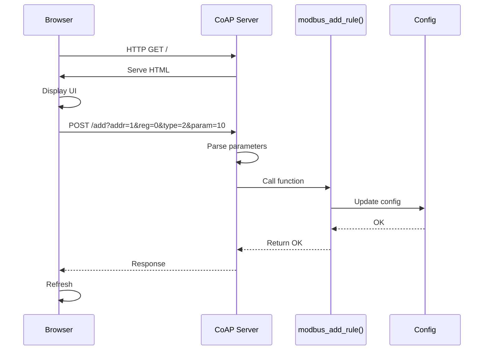
│    rule()    │
└──────┬───────┘
       │ Update config
       ▼
┌──────────────┐
│  Return OK   │
└──────┬───────┘
       │
       ▼
┌─────────────┐
│   Browser   │
│  Refresh    │
└─────────────┘
```

## State Machine

### Modbus Proxy State

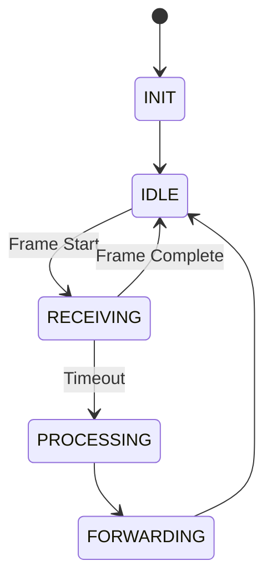

### WiFi Connection State

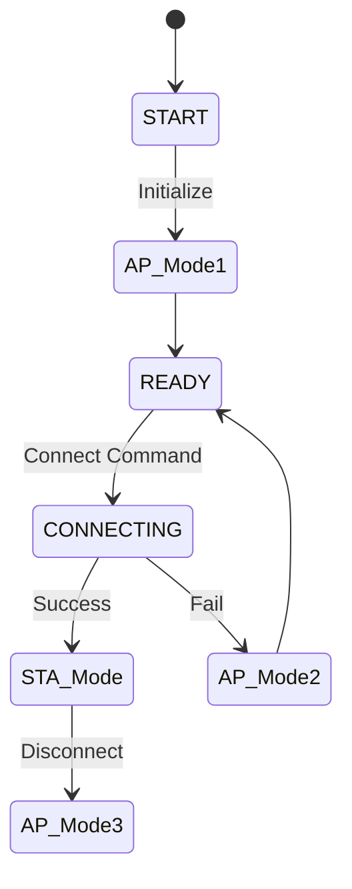

## Performance Characteristics

### Latency Analysis

```
Total Latency = RX_Time + Process_Time + TX_Time

RX_Time:     ~0.5ms  (for typical 8-byte frame at 9600 baud)
Process_Time: <1ms   (frame parsing + modification)
TX_Time:     ~0.5ms  (for typical 8-byte frame at 9600 baud)

Total:       ~2ms    (typical)
```

### Throughput Capacity

```
Baud Rate: 9600 bps
Effective: ~960 bytes/second (with overhead)

Typical Modbus Frame: 8-20 bytes
Max Throughput: ~48-120 frames/second

Actual Throughput: ~30-40 frames/second
(includes protocol overhead and processing time)
```

## Error Handling

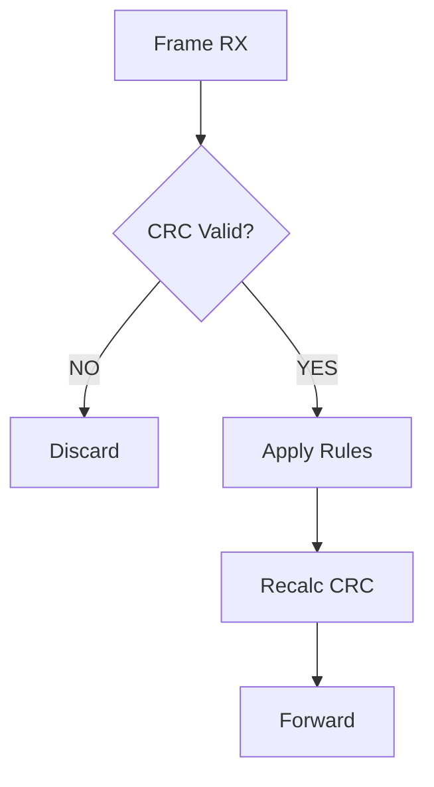

## Future Enhancements Architecture

### With Configuration Persistence

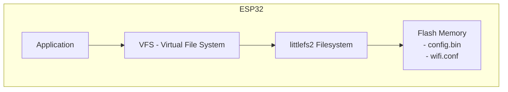

### With MQTT Support

```
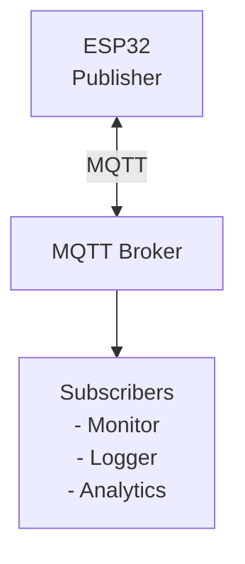

**MQTT Topics:**
- `modbus/proxy/status`
- `modbus/proxy/stats`
- `modbus/proxy/config`
- `modbus/proxy/frames`

## Legend

**Diagram Symbols:**
- Boxes: Components or Modules
- Arrows: Data flow direction
- Double arrows (↔): Bidirectional communication
- `[120Ω]`: Resistor or passive component

