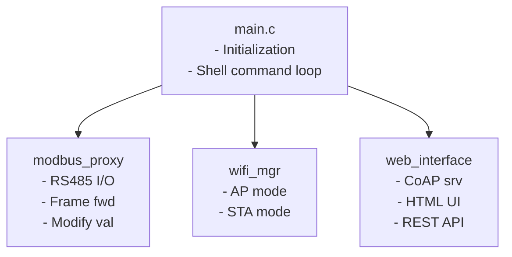
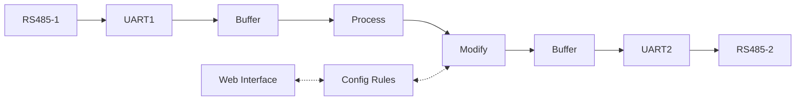

# Development Guide

## Getting Started with Development

### Development Environment Setup

1. **Install RIOT OS**
   ```bash
   git clone https://github.com/RIOT-OS/RIOT.git
   cd RIOT
   git checkout 2024.01  # Use stable release
   ```

2. **Install Toolchains**
   
   For ESP32:
   ```bash
   # Install ESP-IDF prerequisites
   sudo apt-get install git wget flex bison gperf python3 python3-pip \
        python3-setuptools cmake ninja-build ccache libffi-dev libssl-dev \
        dfu-util libusb-1.0-0
   
   # Install ESP-IDF
   cd ~
   git clone --recursive https://github.com/espressif/esp-idf.git
   cd esp-idf
   ./install.sh esp32
   . ./export.sh
   ```

3. **Clone and Build Project**
   ```bash
   git clone https://github.com/the78mole/modbus-modifying-proxy.git
   cd modbus-modifying-proxy
   make BOARD=esp32-wroom-32 all
   ```

### Project Structure

```
modbus-modifying-proxy/
├── main.c                    # Application entry point
├── modbus_proxy.h           # Modbus proxy interface
├── modbus_proxy.c           # Modbus proxy implementation
├── wifi_manager.h           # WiFi management interface
├── wifi_manager.c           # WiFi management implementation
├── web_interface.h          # Web interface
├── web_interface.c          # Web server implementation
├── Makefile                 # RIOT OS build configuration
├── README.md                # Main documentation
├── CONFIGURATION.md         # Configuration guide
├── HARDWARE.md              # Hardware setup
├── QUICKSTART.md           # Quick start guide
├── EXAMPLES.md             # Real-world examples
└── .gitignore              # Git ignore rules
```

## Code Architecture

### Module Overview



### Threading Model

The application uses multiple threads:

1. **Main Thread**: Shell and system management
2. **Interface 1→2 Thread**: Forwards from RS485-1 to RS485-2
3. **Interface 2→1 Thread**: Forwards from RS485-2 to RS485-1
4. **Web Server Thread**: Handles HTTP/CoAP requests
5. **WiFi Thread**: Manages WiFi connection (ESP-IDF internal)

### Data Flow



## Adding New Features

### Adding a New Modification Type

1. **Update enum in modbus_proxy.h**
   ```c
   typedef enum {
       // ... existing types ...
       MOD_TYPE_CUSTOM = 6,  // Add new type
   } modify_type_t;
   ```

2. **Implement logic in modbus_proxy.c**
   ```c
   static int32_t apply_modification(uint8_t addr, uint16_t reg, int32_t value)
   {
       // ... existing code ...
       
       case MOD_TYPE_CUSTOM:
           value = your_custom_logic(value, config.rules[i].param);
           break;
   }
   ```

3. **Update web interface in web_interface.c**
   ```html
   <option value='6'>Custom</option>
   ```

### Adding Configuration Persistence

1. **Enable littlefs2 in Makefile** (already done)
   ```makefile
   USEMODULE += littlefs2
   USEMODULE += vfs
   ```

2. **Implement save/load functions**
   ```c
   int save_config_to_flash(const modbus_config_t *config) {
       // Open file
       int fd = vfs_open("/config.bin", O_WRONLY | O_CREAT, 0);
       // Write config
       vfs_write(fd, config, sizeof(modbus_config_t));
       // Close file
       vfs_close(fd);
       return 0;
   }
   
   int load_config_from_flash(modbus_config_t *config) {
       // Open file
       int fd = vfs_open("/config.bin", O_RDONLY, 0);
       // Read config
       vfs_read(fd, config, sizeof(modbus_config_t));
       // Close file
       vfs_close(fd);
       return 0;
   }
   ```

3. **Call on startup/shutdown**
   ```c
   int modbus_proxy_init(void) {
       load_config_from_flash(&config);
       // ... rest of init ...
   }
   ```

### Adding Shell Commands

1. **Define command handler**
   ```c
   static int _cmd_show_rules(int argc, char **argv)
   {
       const modbus_config_t *cfg = modbus_get_config();
       printf("Active Rules: %d\n", cfg->rule_count);
       // ... print rules ...
       return 0;
   }
   ```

2. **Register command in main.c**
   ```c
   static const shell_command_t shell_commands[] = {
       { "show_rules", "Show active modification rules", _cmd_show_rules },
       { NULL, NULL, NULL }
   };
   
   int main(void) {
       // ... init code ...
       shell_run(shell_commands, line_buf, SHELL_DEFAULT_BUFSIZE);
   }
   ```

### Adding Modbus Function Code Support

Currently, only function codes 0x03 (Read Holding Registers) and 0x04 (Read Input Registers) responses are processed.

To add support for other function codes:

1. **Update process_modbus_frame() in modbus_proxy.c**
   ```c
   static void process_modbus_frame(uint8_t *frame, size_t *len)
   {
       uint8_t func = frame[1];
       
       switch (func) {
           case 0x03:  // Read Holding Registers
           case 0x04:  // Read Input Registers
               // ... existing code ...
               break;
               
           case 0x06:  // Write Single Register
               // Add implementation
               break;
               
           case 0x10:  // Write Multiple Registers
               // Add implementation
               break;
       }
   }
   ```

## Testing

### Unit Testing

RIOT OS supports native board testing:

1. **Create test application**
   ```bash
   mkdir tests
   cd tests
   ```

2. **Build for native**
   ```bash
   make BOARD=native all
   ```

3. **Run tests**
   ```bash
   make BOARD=native term
   ```

### Hardware Testing

1. **Use Modbus simulators**
   - ModbusPoll (Master simulator)
   - ModbusSlave (Slave simulator)

2. **Test setup**
   ```
   [ModbusPoll] ← USB-RS485 → [ESP32 IF1] [ESP32 IF2] ← USB-RS485 → [ModbusSlave]
   ```

3. **Verification steps**
   - Send read request from master
   - Verify frame forwarding
   - Check modification applied
   - Confirm CRC recalculation

### Integration Testing

1. **WiFi connectivity**
   ```bash
   # Check AP mode
   nmcli dev wifi
   # Should show "ModbusProxy"
   ```

2. **Web interface**
   ```bash
   # Test CoAP endpoint
   coap-client -m get coap://192.168.4.1:5683/
   ```

3. **Modbus communication**
   ```bash
   # Use modpoll
   modpoll -m rtu -b 9600 -p none -a 1 -r 1 -c 1 /dev/ttyUSB0
   ```

## Debugging

### Serial Debugging

1. **Enable debug output**
   ```makefile
   CFLAGS += -DDEBUG_MODBUS_PROXY
   ```

2. **Add debug prints**
   ```c
   #ifdef DEBUG_MODBUS_PROXY
   printf("DEBUG: Frame received, len=%d\n", len);
   #endif
   ```

3. **Monitor output**
   ```bash
   make BOARD=esp32-wroom-32 term
   ```

### Using GDB

1. **Build with debug symbols**
   ```bash
   make BOARD=esp32-wroom-32 debug
   ```

2. **Start GDB**
   ```bash
   make BOARD=esp32-wroom-32 debug-server
   # In another terminal
   make BOARD=esp32-wroom-32 debug
   ```

### Common Debug Points

- Frame reception: Start of `if1_to_if2_thread()`
- Modification application: Inside `apply_modification()`
- CRC calculation: In `modbus_crc()`
- Web request handling: CoAP handlers

## Performance Optimization

### Memory Optimization

1. **Reduce buffer sizes**
   ```c
   #define MODBUS_MAX_FRAME_SIZE   128  // Reduce if not needed
   ```

2. **Optimize thread stacks**
   ```c
   #define PROXY_THREAD_STACKSIZE  (THREAD_STACKSIZE_DEFAULT)
   ```

3. **Limit rule count**
   ```c
   #define MAX_MODIFY_RULES    16  // Reduce if not needed
   ```

### Speed Optimization

1. **Increase baud rate**
   ```c
   #define UART_BAUDRATE       115200
   ```

2. **Optimize frame timeout**
   ```c
   // Reduce timeout for faster frame detection
   if ((xtimer_now_usec() - last_byte_time) > 3000) {
       break;
   }
   ```

3. **Use compiler optimizations**
   ```makefile
   CFLAGS += -O2
   ```

## Code Style

### Formatting
- Use 4 spaces for indentation
- Maximum line length: 100 characters
- K&R brace style

### Naming Conventions
- Functions: `snake_case`
- Variables: `snake_case`
- Constants: `UPPER_CASE`
- Types: `snake_case_t`

### Documentation
- Use Doxygen-style comments
- Document all public functions
- Include parameter descriptions

Example:
```c
/**
 * @brief Apply modification to a register value
 * 
 * @param addr Modbus device address
 * @param reg Register address
 * @param value Original register value
 * @return Modified register value
 */
static int32_t apply_modification(uint8_t addr, uint16_t reg, int32_t value);
```

## Contributing

### Pull Request Process

1. Fork the repository
2. Create a feature branch
   ```bash
   git checkout -b feature/my-feature
   ```
3. Make your changes
4. Test thoroughly
5. Commit with clear messages
   ```bash
   git commit -m "Add feature: description"
   ```
6. Push to your fork
   ```bash
   git push origin feature/my-feature
   ```
7. Create Pull Request

### Commit Message Format

```
<type>: <subject>

<body>

<footer>
```

Types:
- `feat`: New feature
- `fix`: Bug fix
- `docs`: Documentation changes
- `style`: Code style changes
- `refactor`: Code refactoring
- `test`: Test additions/changes
- `chore`: Build process or auxiliary tool changes

Example:
```
feat: Add support for Modbus function code 0x06

Implement write single register (0x06) support in the
frame processing logic. This allows modifications to be
applied to write operations as well as reads.

Closes #123
```

## Release Process

1. Update version in code
2. Update CHANGELOG.md
3. Tag release
   ```bash
   git tag -a v1.0.0 -m "Release version 1.0.0"
   git push origin v1.0.0
   ```
4. Create GitHub release
5. Build and attach binaries

## Resources

### RIOT OS Documentation
- [RIOT OS Website](https://riot-os.org/)
- [RIOT OS GitHub](https://github.com/RIOT-OS/RIOT)
- [API Documentation](https://doc.riot-os.org/)

### Modbus Resources
- [Modbus Organization](https://modbus.org/)
- [Modbus RTU Specification](https://modbus.org/docs/Modbus_over_serial_line_V1_02.pdf)
- [Modbus Application Protocol](https://modbus.org/docs/Modbus_Application_Protocol_V1_1b3.pdf)

### ESP32 Resources
- [ESP32 Documentation](https://docs.espressif.com/projects/esp-idf/)
- [ESP32 Technical Reference](https://www.espressif.com/sites/default/files/documentation/esp32_technical_reference_manual_en.pdf)

### Tools
- [ModbusPoll](https://www.modbustools.com/modbus_poll.html) - Modbus master simulator
- [ModbusSlave](https://www.modbustools.com/modbus_slave.html) - Modbus slave simulator
- [Wireshark](https://www.wireshark.org/) - Protocol analyzer

## Troubleshooting Development Issues

### Build Errors

**Error: RIOT not found**
```bash
# Set RIOTBASE environment variable
export RIOTBASE=/path/to/RIOT
# Or use in Makefile
make RIOTBASE=/path/to/RIOT all
```

**Error: ESP-IDF not found**
```bash
# Source ESP-IDF environment
. ~/esp-idf/export.sh
```

### Flash Errors

**Error: Port permission denied**
```bash
sudo usermod -a -G dialout $USER
# Log out and log back in
```

**Error: Flash size mismatch**
```bash
# Specify flash size
make BOARD=esp32-wroom-32 FLASH_SIZE=4MB flash
```

### Runtime Errors

**Stack overflow**
```c
// Increase thread stack size
#define PROXY_THREAD_STACKSIZE  (THREAD_STACKSIZE_LARGE + THREAD_EXTRA_STACKSIZE_PRINTF)
```

**Out of memory**
```c
// Reduce buffer sizes or number of rules
#define MAX_MODIFY_RULES    16
#define MODBUS_MAX_FRAME_SIZE   128
```

## Future Enhancements

### Planned Features
- [ ] Configuration persistence (littlefs)
- [ ] MQTT support for remote monitoring
- [ ] Advanced filtering (averaging, rate limiting)
- [ ] Modbus TCP support
- [ ] Web UI improvements (JavaScript framework)
- [ ] OTA (Over-The-Air) updates
- [ ] Statistics and diagnostics
- [ ] Multi-proxy synchronization

### Enhancement Ideas
- Modbus gateway mode (RTU to TCP)
- Data logging to SD card
- Bluetooth configuration
- LCD display support
- Cloud integration
- Machine learning-based anomaly detection

## Contact

- GitHub: https://github.com/the78mole/modbus-modifying-proxy
- Issues: https://github.com/the78mole/modbus-modifying-proxy/issues
- License: MIT
