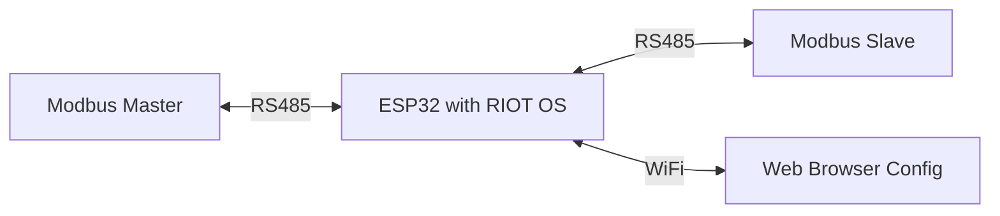

# Modbus Modifying Proxy

This project implements a bidirectional Modbus-to-Modbus proxy for ESP32/ESP32-S3 with the ability to modify register values in transit. It uses RIOT OS as the real-time operating system and provides a web interface for configuration.

## Features

- **Bidirectional Modbus Proxy**: Forwards Modbus messages between two RS485 interfaces
- **Value Modification**: Supports multiple modification types:
  - Overwrite: Replace register value with a constant
  - Add/Subtract: Modify value by adding or subtracting an offset
  - Multiply/Divide: Scale values by a factor
- **Web Interface**: Configure modification rules through a simple web UI
- **WiFi Support**: Works in both Access Point (AP) and Station (STA) modes
- **RIOT OS**: Built on RIOT real-time operating system for reliability

## Hardware Requirements

- ESP32 or ESP32-S3 development board
- 2x RS485 transceivers (e.g., MAX485, MAX3485)
- Appropriate connections for RS485 interfaces

### Pin Configuration

Default pin configuration (can be modified in code):

| Function | GPIO Pin |
|----------|----------|
| RS485 Interface 1 - TX | UART1 TX |
| RS485 Interface 1 - RX | UART1 RX |
| RS485 Interface 1 - DE | GPIO 4 |
| RS485 Interface 2 - TX | UART2 TX |
| RS485 Interface 2 - RX | UART2 RX |
| RS485 Interface 2 - DE | GPIO 5 |

## Software Requirements

- [RIOT OS](https://github.com/RIOT-OS/RIOT) (clone adjacent to this repository)
- ESP-IDF toolchain
- ARM GCC toolchain

## Building the Project

### 1. Setup RIOT OS

```bash
# Clone RIOT OS (if not already done)
cd ..
git clone https://github.com/RIOT-OS/RIOT.git
cd modbus-modifying-proxy
```

### 2. Configure WiFi Credentials (Optional)

Edit the Makefile to change default WiFi credentials:

```makefile
CFLAGS += -DESP_WIFI_SSID=\"YourSSID\"
CFLAGS += -DESP_WIFI_PASS=\"YourPassword\"
```

### 3. Build for ESP32

```bash
# For ESP32
make BOARD=esp32-wroom-32 all

# For ESP32-S3
make BOARD=esp32s3-devkit all
```

### 4. Flash to Device

```bash
# For ESP32
make BOARD=esp32-wroom-32 flash

# For ESP32-S3
make BOARD=esp32s3-devkit flash
```

### 5. Monitor Serial Output

```bash
make BOARD=esp32-wroom-32 term
```

## Usage

### Initial Setup

1. Flash the firmware to your ESP32/ESP32-S3
2. The device will start in AP mode with default credentials:
   - SSID: `ModbusProxy`
   - Password: `modbus123`
3. Connect to the WiFi network
4. Access the web interface at: `http://192.168.4.1:5683/`

### Configuring Modification Rules

The web interface allows you to:

1. **Add Rules**: Configure modification rules for specific Modbus registers
   - Device Address: Modbus slave address (1-247)
   - Register Address: Register number to modify
   - Modification Type: Select the type of modification
   - Parameter: Value for the modification (constant, offset, multiplier, etc.)

2. **View Active Rules**: See all currently active modification rules

3. **Clear Rules**: Remove all modification rules

### Modification Types

- **Overwrite**: Replaces the register value with a constant
  - Example: Always return 100 for register 0
  
- **Add**: Adds a constant to the register value
  - Example: Add 10 to the actual value
  
- **Subtract**: Subtracts a constant from the register value
  - Example: Subtract 5 from the actual value
  
- **Multiply**: Multiplies the register value by a factor
  - Example: Double the value (multiply by 2)
  
- **Divide**: Divides the register value by a divisor
  - Example: Halve the value (divide by 2)

### WiFi Modes

#### Access Point Mode (Default)
- Device creates its own WiFi network
- Default SSID: `ModbusProxy`
- Default Password: `modbus123`

#### Station Mode
- Connect to existing WiFi network
- Use shell commands to configure:
  ```
  wifi_connect <ssid> <password>
  ```

## Architecture



The proxy sits between Modbus master and slave devices, forwarding all messages while applying configured modifications to register values.

## Project Structure

```
.
├── Makefile                 # RIOT OS build configuration
├── main.c                   # Main application entry point
├── modbus_proxy.h/c        # Modbus proxy implementation
├── wifi_manager.h/c        # WiFi management module
├── web_interface.h/c       # Web configuration interface
└── README.md               # This file
```

## Development

### Adding Custom Modifications

To add custom modification types:

1. Add new type to `modify_type_t` enum in `modbus_proxy.h`
2. Implement logic in `apply_modification()` function in `modbus_proxy.c`
3. Update web interface to include new option

### Debugging

Enable development helpers in Makefile:
```makefile
DEVELHELP ?= 1
```

Use RIOT's shell for runtime diagnostics:
- `ps` - List running threads
- `free` - Show memory usage
- Custom commands can be added for Modbus statistics

## Limitations

- Maximum 32 modification rules (can be increased by changing `MAX_MODIFY_RULES`)
- Modbus RTU protocol only (no Modbus TCP support)
- RS485 baud rate: 9600 bps (configurable in code)
- Frame size limited to 256 bytes

## Troubleshooting

### WiFi Not Starting
- Ensure ESP WiFi module is properly compiled
- Check WiFi credentials are correct
- Verify antenna is connected (if external)

### Modbus Communication Issues
- Verify RS485 wiring and termination resistors
- Check baud rate matches your Modbus devices
- Ensure proper ground connections between devices

### Web Interface Not Accessible
- Confirm WiFi connection is established
- Check device IP address (use serial monitor)
- Try CoAP client if HTTP browser doesn't work

## License

MIT License - see LICENSE file for details

## Contributing

Contributions are welcome! Please feel free to submit issues or pull requests.

## Acknowledgments

- Built with [RIOT OS](https://github.com/RIOT-OS/RIOT)
- Inspired by Modbus RTU protocol specification
